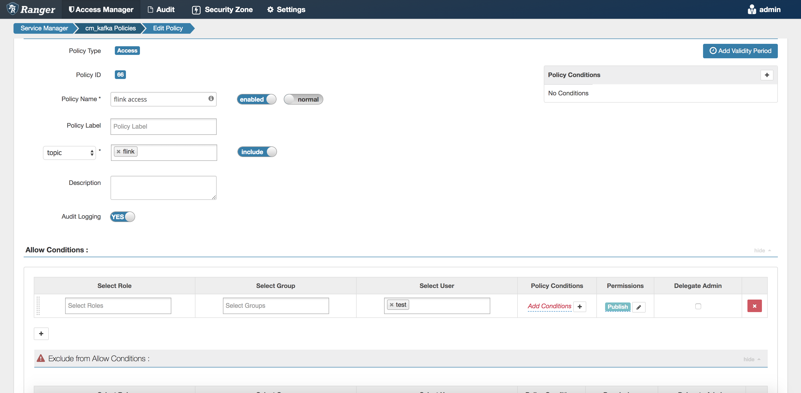

# Flink Application Tutorial for Secured CDP PVC Base Clusters

## Table of Contents

 1. [Overview](#overview)
 2. [Preparation](#preparation)
     + [Cluster setup](#cluster-setup)
     + [Kafka topic](#kafka-topic)
     + [HDFS home directory](#hdfs-home-directory)
     + [Kerberos principal](#kerberos-principal)
     + [Internal TLS encryption](#internal-tls-encryption)
     + [Authorization](#authorization)
 3. [Understanding security parameters](#understanding-security-parameters)
 4. [Running the secured Flink application](#running-the-secured-flink-application)
     + [Using job.properties](#using-jobproperties)
     + [Flink default configs](#flink-default-configs)
     + [ParameterTool](#parametertool)
 5. [Kafka metrics reporter](#kafka-metrics-reporter)
 6. [Schema Registry integration](#schema-registry-integration)

## Overview

This tutorial demonstrates how to enable essential Flink security features (e.g. Kerberos and TLS) for applications that can run in secured CDP PVC Base (CDP for short) environments. Since, we are focusing mainly on security features here the sample application that we use is pretty basic. Our flink job reads messages from a Kafka topic and stores them on HDFS:

```java
public class KafkaToHDFSSimpleJob {

    private static final String BOOTSTRAP_SERVERS = "kafka.bootstrap.servers";
    public static final String KAFKA_TOPIC = "kafkaTopic";

    public static void main(String[] args) throws Exception {
        ParameterTool params = Utils.parseArgs(args);
        StreamExecutionEnvironment env = StreamExecutionEnvironment.getExecutionEnvironment();

        KafkaSource<String> consumer = KafkaSource.<String>builder()
                .setBootstrapServers(params.get(BOOTSTRAP_SERVERS))
                .setTopics(KAFKA_TOPIC)
                .setValueOnlyDeserializer(new SimpleStringSchema())
                .setProperties(Utils.readKafkaProperties(params))
                .build();

        DataStream<String> source = env.fromSource(consumer, WatermarkStrategy.noWatermarks(), "Kafka Source").uid("kafka-source");

        StreamingFileSink<String> sink = StreamingFileSink
                .forRowFormat(new Path(params.getRequired(K_HDFS_OUTPUT)), new SimpleStringEncoder<String>("UTF-8"))
                .build();

        source.addSink(sink)
                .name("FS Sink")
                .uid("fs-sink");
        source.print();

        env.execute("Secured Flink Streaming Job");
    }
}
```
We will introduce the security configs gradually that makes it easier to consume. For more information about Flink Security, see the section [Security Overview](https://docs.cloudera.com/csa/latest/security/topics/csa-authentication.html) in Cloudera Streaming Analytics document.

## Preparation

### Cluster setup

You have to set up Cloudera Runtime 7.0+ clusters with Kerberos (MIT or AD) and TLS integration (Manual or Auto TLS) including the following services:
  * HDFS
  * Kafka
  * YARN
  * Flink
  * Ranger

### Kafka topic

You need to create a Kafka topic called `flink`. Since Kafka configurations are loaded from a *kafka.client.properties* file, you need to create this file first:
```shell
cat << "EOF" > kafka.client.properties
security.protocol=SASL_SSL
ssl.truststore.location=/var/lib/cloudera-scm-agent/agent-cert/cm-auto-global_truststore.jks
sasl.jaas.config=com.sun.security.auth.module.Krb5LoginModule required \
   serviceName=kafka \
   useTicketCache=true;
EOF
```

The topic called `flink` can be created using the following command:
```shell
kafka-topics --command-config=kafka.client.properties --bootstrap-server <your_broker_1>:9093 --create --replication-factor 3 --partitions 3 --topic flink
```
> **Note:** If Ranger is deployed make sure that the current user is authorized to create topics. This can be done on the Ranger UI by navigating to the `cm_kafka` policy group and checking the users added to the policy `all - topic`.

Verify that the topic has been created:
```shell
kafka-topics --command-config=kafka.client.properties --bootstrap-server <your_broker_1>:9093 --list
```

> **Note:** The default non-secured kafka port is 9092, the default TLS port is 9093.

### HDFS home directory

Initialize the HDFS home directory for the test user with a superuser:
```
> kinit hdfs
Password for hdfs@<hostname>: <password_of_hdfs_user>
> hdfs dfs -mkdir /user/test
> hdfs dfs -chown test:test /user/test
```

### Kerberos principal

You also need an existing test user in the Kerberos realm and as local users on each cluster nodes.

Create the user `test` using `kadmin.local` in the local Kerberos server:
```
> kadmin.local
kadmin.local:  addprinc test
Enter password for principal "test@<hostname>": <password_of_test_user>
Re-enter password for principal "test@<hostname>": <password_of_test_user>
Principal "test@<hostname>" created.
kadmin.local:  quit
```

Create the test user locally **on each node**:
```
> useradd test
```

Create a keytab for the test user with `ktutil`:
```
> ktutil
ktutil: add_entry -password -p test -k 1 -e des3-cbc-sha1
Password for test@<hostname>: <password_of_test_user>
ktutil:  write_kt test.keytab
ktutil:  quit
```
List the stored principal(s) from the keytab:
```
> klist -kte test.keytab
Keytab name: FILE:test.keytab
KVNO Timestamp           Principal
---- ------------------- ------------------------------------------------------
   1 09/19/2019 02:12:18 test@<hostname> (des3-cbc-sha1)
```

Verify with `kinit` and `klist` if authentication works properly with the keytab:
```
> kdestroy
> kinit test
Password for test@<hostname>: <password_of_test_user>
> klist -e
Ticket cache: FILE:/tmp/krb5cc_0
Default principal: test@<hostname>

Valid starting       Expires              Service principal
09/24/2019 03:49:09  09/24/2019 04:14:09  krbtgt/<hostname@<hostname
    renew until 09/24/2019 05:19:09, Etype (skey, tkt): des3-cbc-sha1, des3-cbc-sha1
```

The keytab file for Kerberos authentication of the user submitting the Flink job is now created. 

### Internal TLS encryption

For internal TLS encryption generate a keystore file for the user intended to run the Flink application. If the `JAVA_HOME` is not set globally on the host, then the keytool can be usually accessed at `/usr/java/default/bin/keytool`.
```shell
keytool -genkeypair -alias flink.internal -keystore keystore.jks -dname "CN=flink.internal" -storepass <internal_store_password> -keyalg RSA -keysize 4096 -storetype PKCS12
```

The key pair acts as the shared secret for internal security, and we can directly use it as keystore and truststore.

### Authorization

If Ranger is also present the test user should be authorized to publish to the flink topic. This can be done on the Ranger UI. Navigate to `cm_kafka` policy group, click on the `Add New Policy` button, then configure it like this:



> **Note:** If you are automatically logged in to Ranger UI as the current user (and not as `admin`) try opening the Ranger UI in a private / incognito browser window or clear the cookies. Default password for the `admin` user on the Ranger UI is `Admin123`.

## Understanding security parameters

In a production deployment scenario, streaming jobs are understood to run for long periods of time and be able to authenticate to secure data sources throughout the life of the job. Kerberos keytabs do not expire in that timeframe, thus recommended in flink for authentication. Kerberos related configurations are defined as Flink command line parameters (`-yD`):
```
-yD security.kerberos.login.keytab=test.keytab
-yD security.kerberos.login.principal=test
```

Apache Flink differentiates between internal and external connectivity. All internal connections can be SSL authenticated and encrypted. TLS related configurations are also defined as Flink command line parameters (`-yD`):
```
-yD security.ssl.internal.enabled=true
-yD security.ssl.internal.keystore=keystore.jks
-yD security.ssl.internal.key-password=<internal_store_password>
-yD security.ssl.internal.keystore-password=<internal_store_password>
-yD security.ssl.internal.truststore=keystore.jks
-yD security.ssl.internal.truststore-password=<internal_store_password>
-yt keystore.jks
```
> **Note:** External TLS configuration is out of scope of this tutorial

Kafka connector security properties should be defined as normal job arguments, since there are no built-in configurations for them in Flink:
```
--kafka.security.protocol SASL_SSL \
--kafka.sasl.kerberos.service.name kafka \
--kafka.ssl.truststore.location /var/lib/cloudera-scm-agent/agent-cert/cm-auto-global_truststore.jks
```

In our sample application any number of Kafka connector properties can be added to the command dynamically using the `kafka.` prefix. The application forwards them to the Kafka consumer after trimming the `kafka.` prefix from them:
```java
Properties properties = new Properties();
for (String key : params.getProperties().stringPropertyNames()) {
    if (key.startsWith(KAFKA_PREFIX)) {
        properties.setProperty(key.substring(KAFKA_PREFIX.length()), params.get(key));
    }
}

...
        
KafkaSource<String> consumer = KafkaSource.<String>builder()
        .setBootstrapServers(params.get(BOOTSTRAP_SERVERS))
        .setTopics(KAFKA_TOPIC)
        .setValueOnlyDeserializer(new SimpleStringSchema())
        .setProperties(Utils.readKafkaProperties(params))
        .build();
```
> **Note:** The truststore given for the Kafka connector for example is different from the one generated for Flink internal encryption. This is the truststore used to access the TLS protected Kafka endpoint. For more security information, see the Apache Flink documentation about [Kerberos](https://ci.apache.org/projects/flink/flink-docs-stable/deployment/security/security-kerberos.html), [TLS](https://nightlies.apache.org/flink/flink-docs-stable/docs/deployment/security/security-ssl/) and [Kafka](https://ci.apache.org/projects/flink/flink-docs-stable/dev/connectors/kafka.html#enabling-kerberos-authentication) connector.

## Running the secured Flink application

Using additional security configuration parameters, submit Flink application as normal:
```shell
flink run -d -ynm SecureTutorial \
  -yD security.kerberos.login.keytab=test.keytab \
  -yD security.kerberos.login.principal=test \
  -yD security.ssl.internal.enabled=true \
  -yD security.ssl.internal.keystore=keystore.jks \
  -yD security.ssl.internal.key-password=<internal_store_password> \
  -yD security.ssl.internal.keystore-password=<internal_store_password> \
  -yD security.ssl.internal.truststore=keystore.jks \
  -yD security.ssl.internal.truststore-password=<internal_store_password> \
  -yt keystore.jks \
  flink-secure-tutorial-1.16.1-csa1.10.0.0.jar \
  --hdfsOutput hdfs:///tmp/flink-sec-tutorial \
  --kafkaTopic flink \
  --kafka.bootstrap.servers <your_broker_1>:9093 \
  --kafka.security.protocol SASL_SSL \
  --kafka.sasl.kerberos.service.name kafka \
  --kafka.ssl.truststore.location /var/lib/cloudera-scm-agent/agent-cert/cm-auto-global_truststore.jks
 ```
Run the console producer client using the below command and write a few messages into the `flink` topic. 
```shell
kafka-console-producer --broker-list <your_broker_1>:9093 --producer.config kafka.client.properties --topic flink
```
Check the application logs and HDFS output folder (`hdfs:///tmp/flink-sec-tutorial`) to verify that messages arrive as expected. You can check the HDFS output folder on the HDFS NameNode Web UI or using the below commands.

```shell
> hdfs dfs -ls hdfs:///tmp/flink-sec-tutorial
Found 1 items
drwxrwxrwx   - test supergroup          0 2022-03-16 04:31 hdfs:///tmp/flink-sec-tutorial/2022-03-16--04

> hdfs dfs -ls hdfs:///tmp/flink-sec-tutorial/2022-03-16--04
Found 1 items
-rw-r--r--   2 test supergroup         19 2022-03-16 04:32 hdfs:///tmp/flink-sec-tutorial/2022-03-16--04/.part-0-0.inprogress.76298b05-b458-4fe6-9614-6ba24343c0d5

> hdfs dfs -cat hdfs:///tmp/flink-sec-tutorial/2022-03-16--04/.part-0-0.inprogress.76298b05-b458-4fe6-9614-6ba24343c0d5
one
two
three
four
```

You can also read the events you are writing into the `flink` topic if you open another terminal session and run the console consumer client.
```shell
kafka-console-consumer --bootstrap-server <your_broker_1>:9093  --consumer.config kafka.client.properties --topic flink --from-beginning
```

> **Note:** If Ranger is deployed on your cluster make sure that `user` have access to the relevant consumer group.

To test the `RandomKafkaDataGeneratorJob` (which generates random `UUID`s) run the following command. Leave the consumer terminal session open and you will see the generated data in the `flink` topic. You can also check the HDFS output folder (`hdfs:///tmp/flink-sec-tutorial`) again to see if the data is written there as well.

```shell
flink run -d -ynm SecureTutorial \
    -yD security.kerberos.login.keytab=test.keytab \
    -yD security.kerberos.login.principal=test \
    -yD security.ssl.internal.enabled=true \
    -yD security.ssl.internal.keystore=keystore.jks \
    -yD security.ssl.internal.key-password=<internal_store_password> \
    -yD security.ssl.internal.keystore-password=<internal_store_password> \
    -yD security.ssl.internal.truststore=keystore.jks \
    -yD security.ssl.internal.truststore-password=<internal_store_password> \
    -yt keystore.jks \
    -c com.cloudera.streaming.examples.flink.RandomKafkaDataGeneratorJob \
    flink-secure-tutorial-1.16.1-csa1.10.0.0.jar \
    --hdfsOutput hdfs:///tmp/flink-sec-tutorial \
    --kafkaTopic flink \
    --kafka.bootstrap.servers <your_broker_1>:9093 \
    --kafka.security.protocol SASL_SSL \
    --kafka.sasl.kerberos.service.name kafka \
    --kafka.ssl.truststore.location /var/lib/cloudera-scm-agent/agent-cert/cm-auto-global_truststore.jks
```

### Using job.properties

As you can see, the number of security related configuration options can make our `flink run` command fairly complicated pretty quickly.

Therefore, it is recommended to ship connector related security properties along with other business properties in a separate configuration file (e.g. `job.properties`):

```shell
cat << "EOF" > job.properties
kafkaTopic=flink
hdfsOutput=hdfs:///tmp/flink-sec-tutorial
kafka.bootstrap.servers=<your_broker_1>:9093
kafka.security.protocol=SASL_SSL
kafka.sasl.kerberos.service.name=kafka
kafka.ssl.truststore.location=/var/lib/cloudera-scm-agent/agent-cert/cm-auto-global_truststore.jks
EOF
```
Our command looks a bit better now:
```shell
flink run -d -ynm SecureTutorial \
    -yD security.kerberos.login.keytab=test.keytab \
    -yD security.kerberos.login.principal=test \
    -yD security.ssl.internal.enabled=true \
    -yD security.ssl.internal.keystore=keystore.jks \
    -yD security.ssl.internal.key-password=<internal_store_password> \
    -yD security.ssl.internal.keystore-password=<internal_store_password> \
    -yD security.ssl.internal.truststore=keystore.jks \
    -yD security.ssl.internal.truststore-password=<internal_store_password> \
    -yt keystore.jks \
    -c com.cloudera.streaming.examples.flink.RandomKafkaDataGeneratorJob \
    flink-secure-tutorial-1.16.1-csa1.10.0.0.jar \
    --properties.file job.properties
  ```

Cancel the running Data Generator job before execution of the above command. You can use the below commands to list and cancel running jobs.

```shell
> flink list -a
Waiting for response...
------------------ Running/Restarting Jobs -------------------
16.03.2022 04:29:18 : 62706a876f50e442133cee7a79d774a7 : Secured Flink Streaming Job (RUNNING)
16.03.2022 04:43:44 : fbc747c6a41d5685936a842906466e6f : String Data Generator Job (RUNNING)
--------------------------------------------------------------
No scheduled jobs.

> flink cancel fbc747c6a41d5685936a842906466e6f
Cancelling job fbc747c6a41d5685936a842906466e6f.
Cancelled job fbc747c6a41d5685936a842906466e6f.
```

> **Note:** We can also simplify our command further if we leave out the optional TLS configs
```shell
flink run -d -ynm SecureTutorial \
    -yD security.kerberos.login.keytab=test.keytab \
    -yD security.kerberos.login.principal=test \
    -c com.cloudera.streaming.examples.flink.RandomKafkaDataGeneratorJob \
    flink-secure-tutorial-1.16.1-csa1.10.0.0.jar \
    --properties.file job.properties
  ```

### Flink default configs

The keytab and the keystore files that are referred to as `test.keytab` and `keystore.jks` respectively are distributed automatically to the temporary folder of the YARN container on the remote hosts. These properties are user specific, and usually cannot be added to the default Flink configuration unless a single technical user is used to submit the Flink jobs. If there is a dedicated technical user for submitting Flink jobs on a cluster, the keytab and keystore files can be provisioned to the YARN hosts in advance. In this case the related configuration parameters can be set globally in Cloudera Manager using Safety Valves.

### ParameterTool

Flink has a built-in `ParameterTool` class to handle program arguments elegantly. You can merge the arguments given in the command line and configuration file as done by the `parseArgs` function of `Utils`:
```java
ParameterTool params = ParameterTool.fromArgs(args);
String propertiesFile = params.get("properties.file");

if (propertiesFile != null) {
    params = ParameterTool.fromProperties(propertiesFile).mergeWith(params);
}

LOG.info("### Job parameters:");
for (String key : params.getProperties().stringPropertyNames()) {
    LOG.info("Param: {}={}", key, params.get(key));
}

String kafkaTopic = params.get("kafkaTopic");
String hdfsOutput = params.get("hdfsOutput");
```

## Kafka metrics reporter

There is a metrics reporter implementation for writing Flink metrics to a target Kafka topic in JSON format. The corresponding security related Kafka properties can be set either in the command itself or [globally using Cloudera Manager Safety Valve](https://docs.cloudera.com/cloudera-manager/7.4.2/configuration-properties/topics/cm_props_cdh720_flink.html#ariaid-title2).
```
-yD metrics.reporter.kafka.class=org.apache.flink.metrics.kafka.KafkaMetricsReporter \
-yD metrics.reporter.kafka.topic=metrics-topic.log \
-yD metrics.reporter.kafka.bootstrap.servers=<your_broker_1>:9093 \
-yD metrics.reporter.kafka.security.protocol=SASL_SSL \
-yD metrics.reporter.kafka.sasl.kerberos.service.name=kafka \
-yD metrics.reporter.kafka.ssl.truststore.location=/var/lib/cloudera-scm-agent/agent-cert/cm-auto-global_truststore.jks \
```

Use the following command to check the metrics, but don't forget to add `metrics-topic.log` topic to the [`flink access` policy](#authorization) before.

```shell
kafka-console-consumer --bootstrap-server <your_broker_1>:9093  --consumer.config kafka.client.properties --topic metrics-topic.log --from-beginning
```

## Schema Registry integration

Flink Kafka sources and sinks can be used together with Cloudera Schema Registry to maintain schema information about your Kafka topics. In this example, the schema registry is used to provide automatic serialization/deserialization functionality for Kafka Avro messages.

The ```Message``` Avro type is a Java class generated from the Avro schema ```message.avsc``` during compile time:
```json
{"namespace": "com.cloudera.streaming.examples.flink.data",
 "type": "record",
 "name": "Message",
 "fields": [
     {"name": "id", "type": "string"},
     {"name": "name",  "type": "string"},
     {"name": "description", "type": "string"}
 ]
}
```

The schema of the Avro types are automatically registered in the Cloudera Schema Registry at the first record serialization.

The schema registry can be plugged directly into a ```KafkaSource``` or a ```KafkaSink``` using the appropriate ```ClouderaRegistryAvroKafkaDeserializationSchema``` and ```ClouderaRegistryAvroKafkaRecordSerializationSchema``` classes respectively.

Two sample Jobs were written to demonstrate how to integrate with Cloudera Schema Registry from Flink in a secured way.

The ```AvroDataGeneratorJob``` uses a Kafka sink with ```ClouderaRegistryAvroKafkaRecordSerializationSchema``` to write ```Message``` records to a Kafka topic:
```java
public class AvroDataGeneratorJob {

    public static void main(String[] args) throws Exception {

        ...

        String topic = params.getRequired(K_KAFKA_TOPIC);
        KafkaRecordSerializationSchema<Message> schema = ClouderaRegistryAvroKafkaRecordSerializationSchema
                .<Message>builder(topic)
                .setConfig(Utils.readSchemaRegistryProperties(params))
                .setKey(Message::getId)
                .build();

        KafkaSink<Message> kafkaSink = KafkaSink.<Message>builder()
                .setBootstrapServers(params.get(BOOTSTRAP_SERVERS))
                .setRecordSerializer(schema)
                .setKafkaProducerConfig(Utils.readKafkaProperties(params))
                .setDeliverGuarantee(DeliveryGuarantee.AT_LEAST_ONCE)
                .build();

        ...
    }
}
```

The ```KafkaToHDFSAvroJob``` uses a Kafka source with ```ClouderaRegistryAvroKafkaDeserializationSchema``` to read the Avro records. Then, it saves them as CSV files into HDFS and standard output:
```java
public class KafkaToHDFSAvroJob {

    public static void main(String[] args) throws Exception {

        ...

        KafkaDeserializationSchema<Message> schema = ClouderaRegistryAvroKafkaDeserializationSchema
                .builder(Message.class)
                .setConfig(Utils.readSchemaRegistryProperties(params))
                .build();

        KafkaSource<Message> kafkaSource = KafkaSource.<Message>builder()
                .setBootstrapServers(params.get(BOOTSTRAP_SERVERS))
                .setTopics(params.get(K_KAFKA_TOPIC))
                .setDeserializer(KafkaRecordDeserializationSchema.of(schema))
                .setProperties(Utils.readKafkaProperties(params))
                .build();

        DataStream<String> source = env.fromSource(kafkaSource, WatermarkStrategy.noWatermarks(), "Kafka Source")
                .uid("kafka-source")
                .map(record -> record.getId() + "," + record.getName() + "," + record.getDescription())
                .name("To Output String")
                .uid("to-output-string");
        ...
    }
}
```

The ```ClouderaRegistryAvroKafkaRecordSerializationSchema/ ClouderaRegistryAvroKafkaDeserializationSchema ``` related configuration parameters can be shipped in the job.properties file too:
```properties
schema.registry.url=https://<your_broker_1>:7790/api/v1
schema.registry.client.ssl.trustStorePath=/var/lib/cloudera-scm-agent/agent-cert/cm-auto-global_truststore.jks
schema.registry.client.ssl.trustStorePassword=<trust_store_password>
```

The password for the trust store can be retrieved as follows:
```shell
>ps aux | pgrep -u kafka
16131
16148
16206
16207
16221
16222
>cat /proc/<highest_pid_listed_above>/environ
... KAFKA_BROKER_TRUSTORE_PASSWORD=<trust_store_password> ...
```

> **Note:**  If Ranger is deployed on your cluster make sure the `test` user has access to the schema groups and schema metadata through the `cm_schema-registry` policy group

Once the schema registry properties has been added to `job.properties` the `AvroDataGeneratorJob` can be submitted with:

```shell
flink run -d -ynm AvroDataGeneratorJob \
-yD security.kerberos.login.keytab=test.keytab \
-yD security.kerberos.login.principal=test \
-c com.cloudera.streaming.examples.flink.AvroDataGeneratorJob \
flink-secure-tutorial-1.16.1-csa1.10.0.0.jar \
--properties.file job.properties
```
The generated avro messages can be read by the `KafkaToHDFSAvroJob`

```shell
flink run -d -ynm KafkaToHDFSAvroJob \
-yD security.kerberos.login.keytab=test.keytab \
-yD security.kerberos.login.principal=test \
-c com.cloudera.streaming.examples.flink.KafkaToHDFSAvroJob \
flink-secure-tutorial-1.16.1-csa1.10.0.0.jar \
--properties.file job.properties
```

For Kerberos authentication Flink provides seamless integration for Cloudera Schema Registry through the `security.kerberos.login.contexts` property:
```properties
security.kerberos.login.contexts=Client,KafkaClient,RegistryClient
```


