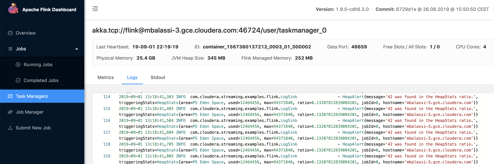

# Stateless Monitoring Application
The purpose of the Flink tutorial Application is to provide a self-contained boilerplate code example for a Flink application.

## Table of contents
1. [Overview](#overview)
2. [Build](#build)
3. [Application logic](#application-logic)
4. [Application main class](#application-main-class)
    1. [Creating the stream of heap metrics](#creating-the-stream-of-heap-metrics)
    2. [Computing GC warnings and heap alerts](#computing-gc-warnings-and-heap-alerts)
5. [Running the application from IntelliJ](#running-the-application-from-intellij)
6. [Testing our data pipeline](#testing-our-data-pipeline)
    1. [Producing test input](#producing-test-input)
    2. [Collecting the test output](#collecting-the-test-output)
7. [Running the application on a Cloudera cluster](#running-the-application-on-a-cloudera-cluster)
    1. [Writing logs to Kafka](#writing-logs-to-kafka)
    2. [Writing output to HDFS](#writing-output-to-hdfs)


## Overview
The application demonstrates basic capabilities of the DataStream API and shares best practices for testing and logging.

The tutorial demonstrates:
1. Writing and deploying a Flink application
2. Interacting with the Flink logging framework
3. Testing a Flink application

## Build
Check out the repository and build the artifact:
```
git clone https://github.infra.cloudera.com/morhidi/flink-ref.git
cd flink-ref/flink-simple-tutorial
mvn clean package
```

## Application logic
The application monitors the metrics of the JVM heap that it is running on and produces metrics records similar to the following:
```
HeapMetrics{area=PS Old Gen, used=14495768, max=2863661056, ratio=0.005061970574215889, jobId=1, hostname='martonbalassis-MacBook-Pro.local'}
```
We can build on this input to also demonstrate an alerting solution. As a simple alerting logic consider the following: when the ratio component of the
heap statistics contains a substring specified by the user we send an alert. Let's refer to this substring in question as alert mask.

So for example if the we choose the alert mask as `42` then for the above statistics we will produce an alert:
```
HeapAlert{message='42 was found in the HeapMetrics ratio.', triggeringStats=HeapMetrics{area=PS Old Gen, used=14495768, max=2863661056, ratio=0.005061970574215889, jobId=1, hostname='martonbalassis-MacBook-Pro.local'}}
```

In this example we are demonstrating how you can direct these alerts to sinks like stderr or Kafka via the logging framework.

Our Heap monitoring appliction will have 4 structural components:

1. **Application main class:** Defines the `StreamExecutionEnvironment` and creates the pipeline.
2. **Data Sources:** Access the heap information and make it available for processing.
3. **Processing operators and flow:** Process the heap usage information to detect critical memory levels and produce the alerts.
4. **Data Sinks:** Store the memory information collected on HDFS and log the alerts to the configured logger.

## Application main class

A Flink application has to define a main class that will be executed on the client side on job submission. The main class will define the application pipeline that is going to be executed on the cluster.

Our main class is the `HeapMonitorPipeline` which contains a main method like any standard Java application. The arguments passed to our main method will be determined by us when we use the flink client. We use the  `ParameterTool` utility to conveniently pass parameters to our job that we can use in our operator implementations.

At first we create the `StreamExecutionEnvironment` which can be used to create DataStreams and to configure important job parameters such as checkpointing behaviour to guarantee data consistency for our application.

```java
final StreamExecutionEnvironment env = StreamExecutionEnvironment.getExecutionEnvironment();
env.enableCheckpointing(10_000);
```

The `getExecutionEnvironment()` static call guarantees that our pipeline will always be using the correct environment based on the location it is executed. When running from our IDE this means a local execution environment, and when running from the client for cluster submission it will return the yarn execution environment.

Even though this application doesn't rely on user defined state we enable checkpointing every 10 seconds to allow the datasinks to produce consistent output to HDFS.

The rest of the main class defines the application sources, processing flow and the sinks followed by the `execute()` call which will trigger the actual execution of the pipeline either locally or on the cluster.

### Creating the stream of heap metrics

The key data abstraction for every Flink streaming application is the `DataStream` which is a bounded or unbounded flow of records. In our application we will be processing memory related information so we created the `HeapMetrics` class to represent our data records.

The `HeapMetrics` class has a few key properties that make it efficiently serializable by the Flink type system that we note here:

1. It is public and standalone class (no non-static inner class)
2. It has a public empty constructor
3. All fields are public non final

These classes are called POJOs in the Flink community. It is possible to structure the class differently by keeping the same serialization properties, for the exact rules please refer to the docs: https://ci.apache.org/projects/flink/flink-docs-stable/dev/types_serialization.html#rules-for-pojo-types

Now that we have our record class we need to produce a `DataStream<HeapMetrics>` of the heap information by adding a source to our StreamExecutionEnvironment. Flink comes with a wide variety of built-in sources for different input connectors, but in our case we will build a custom source that collects heap statistics from the host JVM.
The `HeapMonitorSource` class extends the `RichParallelSourceFunction<HeapMetrics>` abstract class which allows us to use it as a data source.

Let's take a closer look at this class:

- Every Flink source must implement the `SourceFunction` interface which at it's core provides 2 methods that will be called by the Flink runtime during cluster execution:
 - `run(SourceContext)`: This method should contain the data producer loop. Once it finishes the source shuts down.
 - `cancel()`: This method is called if the source should terminate before it is finished, i.e. break out early from the `run` method

- The `RichParallelSourceFunction` extends the basic `SourceFunction` behaviour in 2 important ways:
 - It extends the `ParallelSourceFunction`, allowing Flink to create multiple instances of the source logic. One per parallel task instance.
 - It extends the `RichFunction` abstract class which allows the implementation to access runtime information such as parallelism and subtask index that we will leverage in our source implementation.

Our source will continuously poll the heap memory usage of this application and output it along with some task related information producing the datastream.

### Computing GC warnings and heap alerts

The core data processing logic is encapsulated in the `HeapMonitorPipeline.computeHeapAlerts(DataStream<HeapMetrics> statsInput, ParameterTool params)` method that takes as input the strean of heap information and should produce a stream of alerts when the conditions are met.

The reason for structuring the code this way is to make our pipeline easily testable later by replacing our production data source with the test data stream.

The core alerting logic is implemented in the `AlertingFunction` class. It is a `FlatMapFunction` that filters out incoming heap stats objects according to the configured thresholds and converts them to `HeapAlerts`. We leverage the `ParameterTool` object coming from our main program entry point to make these alerting thresholds configurable when using the Flink client later.

## Running the application from IntelliJ

The tutorial application is based on the upstream Flink quickstart maven archetype. The project can be imported into IntelliJ by following the instructions from the public Flink documentation:
https://ci.apache.org/projects/flink/flink-docs-stable/dev/projectsetup/java_api_quickstart.html#maven

In order to run applications directly from the IDE you must enable the `add-dependencies-for-IDEA` profile, to ensure that provided dependencies that would be otherwise supplied by the runtime environment are available here.

Simply run the class `HeapMonitorPipeline` from the IDE which should print one or multiple lines to the console (depending on the number of cores of your machine chosen as default parallelism):
```
...
13:50:54,524 INFO  com.cloudera.streaming.examples.flink.HeapMonitorSource       - starting HeapMonitorSource
13:50:54,524 INFO  com.cloudera.streaming.examples.flink.HeapMonitorSource       - starting HeapMonitorSource
13:50:54,524 INFO  com.cloudera.streaming.examples.flink.HeapMonitorSource       - starting HeapMonitorSource
13:50:54,524 INFO  com.cloudera.streaming.examples.flink.HeapMonitorSource       - starting HeapMonitorSource
...
```

Once the application has successfully started we can observe `HeapMetrics` events printed to stdout in rapid succession:

```
3> HeapMetrics{area=PS Survivor Space, used=10980192, max=11010048, ratio=0.9972882952008929, jobId=2, hostname='martonbalassis-MacBook-Pro.local'}
3> HeapMetrics{area=PS Old Gen, used=14410024, max=2863661056, ratio=0.005032028483192111, jobId=2, hostname='martonbalassis-MacBook-Pro.local'}
4> HeapMetrics{area=PS Eden Space, used=19258296, max=1409286144, ratio=0.013665284429277693, jobId=3, hostname='martonbalassis-MacBook-Pro.local'}
```

Having a prefix in the above output lines (`3>` and `>4` in the example) is a feature of the `DataStream.print()` function.
The prefix refers to the sequential id of each parallel instance of the sink.

Occasionally, the application triggers alerts that are printed to stderr via the logging framework.

```
08:20:11,829 INFO  com.cloudera.streaming.examples.flink.LogSink  - HeapAlert{message='42 was found in the HeapMetrics ratio.', triggeringStats=HeapMetrics{area=PS Eden Space, used=23876376, max=1409286144, ratio=0.016942177500043596, jobId=0, hostname='martonbalassis-MacBook-Pro.local'}}
```

Let's explore this logging implementation and it's configuration. `LogSink` is a custom sink implementation that simply sends the messages to the logging framework. The logs can be redirected via log4j to any centralized logging system or simply printed to the standard output when debugging. The quick start application provides a sample log4j config for redirecting the alert logs to the standard error.

```
log4j.rootLogger=INFO, stdout

log4j.logger.com.cloudera.streaming.examples.flink.LogSink=INFO, stderr
log4j.additivity.com.cloudera.streaming.examples.flink.LogSink=false

log4j.appender.stdout=org.apache.log4j.ConsoleAppender
log4j.appender.stdout.layout=org.apache.log4j.PatternLayout
log4j.appender.stdout.Target   = System.out
log4j.appender.stdout.layout.ConversionPattern=%d{HH:mm:ss,SSS} %-5p %-60c %x - %m%n

log4j.appender.stderr=org.apache.log4j.ConsoleAppender
log4j.appender.stderr.layout=org.apache.log4j.PatternLayout
log4j.appender.stderr.Target   = System.err
log4j.appender.stderr.layout.ConversionPattern=%d{HH:mm:ss,SSS} %-5p %-60c %x - %m%n
```
The alerts mask is configurable a parameter to produce more frequent hits for testing:

```
--alertMask 42
--alertMask 4
```

## Testing our data pipeline
The business logic of a Flink application consists of one or more operators chained together, which is often called a pipeline. Pipelines can be extracted to static methods and can be easily tested with JUnit framework. The `HeapMonitorPipelineTest` class gives a sample for this.

A simple JUnit test was written to verify our core application logic. The test is implemented in the `HeapMonitorPipelineTest` and should be regarded as an integration test of the application flow. Even though this pipeline is very simple we can later use the same idea to test more complex application flows.

Our test mimics our application main class with only minor differences:
1. We create the `StreamExecutionEnvironment` the same ways
2. Instead of using our source implementation we will use the `env.fromElements(..)` method to pre-populate a `DataStream` with some testing data.
3. We feed this data to our static data processing logic like before.
4. Instead of writing the output anywhere we verify the correctness once the pipeline finished.

### Producing test input

The Flink environment has several methods that can be used to produce data for testing. In our case we pass the elements of the stream directly, but we could have also implemented a custom source for example. We have to keep in mind that the ordering guarantees of the messages processed depend on the sources and partitioning of the downstream flow.

### Collecting the test output

To be able to assert the correctness of the output, first we need to get hold of the output elements. The simplest thing to do in this case was to write a custom data sink that collects the incoming elements into a static `Set<HeapAlert>`.

We have specifically set the parallelism of our data sink to 1 to avoid any concurrency issues that might arise from parallel execution.

As we cannot always force strict ordering for the output elements we used a `Set` instead of a `List` to compare expected output regardless of the order. This might or might not be the correct approach depending on the application flow, but it works very well in our case.

## Running the application on a Cloudera cluster
The Flink tutorial Application can be deployed on a CDH cluster remotely. The actual version of the application was tested against CDH6.3.0 and FLINK-1.9.0-csa0.1.1-cdh6.3.0-1420238-el7 without any security integration on it. The Flink parcel is accessible at the [flink-temporary repo](http://support-ci.sre-dev.cloudera.com:8081/artifactory/webapp/#/artifacts/browse/tree/General/flink-temporary)
After you have [built](#Build) the project run the application from a Flink GateWay node:

```
flink run -m yarn-cluster -d -p 2 -ynm HeapMonitor target/flink-simple-tutorial-1.0-SNAPSHOT.jar
```

After launching the application Flink will create a YARN session and launch a dashboard where the application can be monitored. The Flink dashbord can be reached from CM through the following path:
`Cluster->Yarn->Applications->application_<ID>->Tracking URL:ApplicationMaster`.


Following through this link we can access the Flink application master webdashboard. On the dashboard we can choose the TaskManagers tab on the left navigation pane to gain access to the logs.



In this case we have actually run the application with the default `log4j.configuration` controlled by CM and not with the one we have used locally in our IDE.

### Writing logs to Kafka
Log messages from a Flink application can be also collected and forwarded to a Kafka topic for convenience. This requires only a few extra configuration steps and dependencies in Flink. The default log4j config can be overriden with a command parameter:

```
-yD log4j.configuration.file=kafka-appender/log4j.properties
```

By default we are using the `flink-heap-alerts` Kafka topic for tracking the alerts. You can create this topic as follows:
```
kafka-topics --create --partitions 16 --replication-factor 1 --zookeeper <your_zookeeper>:2181 --topic flink-heap-alerts```
```

An example for the full command with Kafka logging:
```
flink run -m yarn-cluster -yD log4j.configuration.file=kafka-appender/log4j.properties -d -p 2 -ynm HeapMonitor target/flink-simple-tutorial-1.0-SNAPSHOT.jar
```

Accessing the logs from the Kafka topic is possible then with:
```
kafka-console-consumer --bootstrap-server <your_broker>:9092 --topic flink-heap-alerts
...
00:17:53,398 INFO  com.cloudera.streaming.examples.flink.LogSink                 - HeapAlert{message='42 was found in the HeapMetrics ratio.', triggeringStats=HeapMetrics{area=PS Eden Space, used=54560840, max=94371840, ratio=0.578147464328342, jobId=0, hostname='<yourhostname>'}}

00:17:53,498 INFO  com.cloudera.streaming.examples.flink.LogSink                 - HeapAlert{message='42 was found in the HeapMetrics ratio.', triggeringStats=HeapMetrics{area=PS Eden Space, used=54560840, max=94371840, ratio=0.578147464328342, jobId=0, hostname='<yourhostname>'}}

00:17:53,599 INFO  com.cloudera.streaming.examples.flink.LogSink                 - HeapAlert{message='42 was found in the HeapMetrics ratio.', triggeringStats=HeapMetrics{area=PS Eden Space, used=54560840, max=94371840, ratio=0.578147464328342, jobId=0, hostname='<yourhostname>'}}

00:17:53,700 INFO  com.cloudera.streaming.examples.flink.LogSink                 - HeapAlert{message='42 was found in the HeapMetrics ratio.', triggeringStats=HeapMetrics{area=PS Eden Space, used=54560840, max=94371840, ratio=0.578147464328342, jobId=0, hostname='<yourhostname>'}}

00:17:53,800 INFO  com.cloudera.streaming.examples.flink.LogSink                 - HeapAlert{message='42 was found in the HeapMetrics ratio.', triggeringStats=HeapMetrics{area=PS Eden Space, used=54560840, max=94371840, ratio=0.578147464328342, jobId=0, hostname='<yourhostname>'}}
```
### Writing output to HDFS

On a cluster environment we also prefer to write the output to a durable storage medium. We have choosen HDFS for this storage layer. We can switch to the HDFS writer from the
stdout writer with the following parameter:

```
--cluster true
```

By default the output files will be stored under `hdfs:///tmp/flink-heap-stats`, but this location is configurable via the `--output` parameter. The complete command saving the HDFS and
logging to Kafka is:

```
flink run -m yarn-cluster -yD log4j.configuration.file=kafka-appender/log4j.properties -d -p 2 -ynm HeapMonitor target/flink-simple-tutorial-1.0-SNAPSHOT.jar --cluster true
```

To inspect the output we can call `hdfs` directly:

```
hdfs dfs -cat /tmp/flink-heap-stats/*/*
...
HeapMetrics{area=PS Eden Space, used=50399064, max=90701824, ratio=0.5556565654071081, jobId=1, hostname='<yourhostname>'}
HeapMetrics{area=PS Survivor Space, used=903448, max=15728640, ratio=0.05743967692057292, jobId=1, hostname='<yourhostname>'}
HeapMetrics{area=PS Old Gen, used=19907144, max=251658240, ratio=0.07910388310750326, jobId=1, hostname='<yourhostname>'}
```
