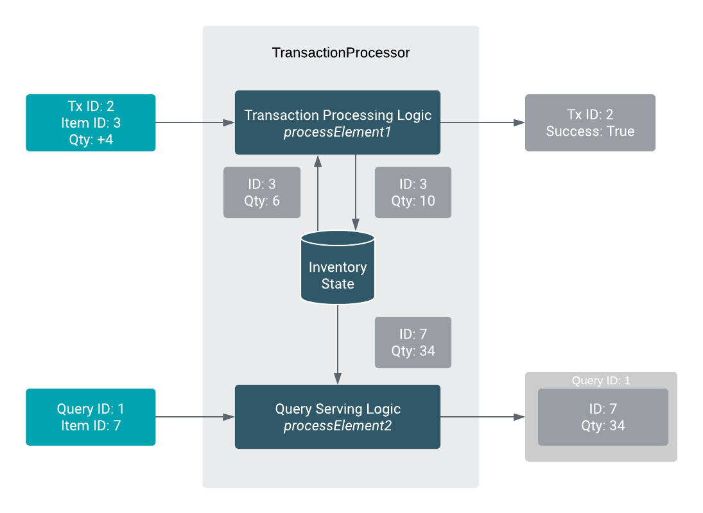

# Real-time item management service

## Table of contents
1. [Overview](#overview)
    + [Overview of the data pipeline](#overview-of-the-data-pipeline)
2. [Implementing the Flink Streaming Application](#implementing-the-flink-streaming-application)
    + [Structuring the application code](#structuring-the-application-code)
    + [Inventory management and query logic](#inventory-management-and-query-logic)
    + [Setting up Kafka inputs and outputs](#setting-up-kafka-inputs-and-outputs)
    + [Windowed transaction summaries](#windowed-transaction-summaries)
3. [Testing and validating the pipeline](#testing-and-validating-our-pipeline)
4. [Production configuration](#production-configuration)
    + [StreamExecutionEnvironment configuration](#configuring-the-streamexecutionenvironment)
    + [Parallelism and resources](#parallelism-and-resources)
    + [Kafka configuration](#kafka-topic-configuration)
5. [Deployment](#deploying-the-application)
    + [Transaction Generator Job](#kafka-data-generator)
    + [Transaction Processor Job](#kafka-transaction-job)

## Overview

The Stateful Flink Application tutorial implements the backend logic of an item management system. You can think of this as the service that handles the available items for a large e-commerce site or any other similar application.

The service should have the following capabilities:

 1. Validate and execute the incoming item transaction requests (new stock / purchase requests essentially)
 2. Output the result of the transactions (success / failure)
 3. Expose query functionality for the current item status (number in stock)
 4. Output periodic transaction summaries

Keeping in mind the purpose of the application, we designed it to scale to very large transaction and query rates, up to millions of transactions/queries per second. And also to be able to handle very large inventories, hundreds of millions or more items. As always the scale at which the application can perform well will depend on the available resources, but we will provide you the configuration guidelines to achieve good performance on the desired scale.

**Note**
For the sake of readability, the rest of the tutorial uses command line parameters in short form:
+ Long form:
`flink run --jobmanager yarn-cluster --detached --parallelism 2 --yarnname HeapMonitor target/flink-stateful-tutorial-1.2-SNAPSHOT.jar`
+ Short form:
`flink run -m yarn-cluster -d -p 2 -ynm HeapMonitor target/flink-stateful-tutorial-1.2-SNAPSHOT.jar`

### Overview of the data pipeline

Let's take a quick look at a simple illustration of the data pipeline:


From this we can identify the key elements of the dataflow

 + Transaction & Query sources
 + Stateful Transaction & Query processor
 + Transaction Summary aggregator
 + Output sinks

The pipeline has two inputs, Transaction Source for transactions and Query Source for queries. Both are consumed by a single operator, Transaction & Query Processor, which stores the current inventory state. The identifier of the inventory item is used as key for both streams to match the queries to the transactions. The pipeline has three output sinks for three distinct functionalities: TransactionResult Sink for transaction results, QueryResult Sink for query results and Summary Sink for periodic summaries.

**Note**
Both `ItemTransaction` and `ItemQuery` requests need access to the current item state. You need to process the requests in a single operator as the state cannot be shared between multiple operators in Flink.

The core business logic is built into Transaction & Query processor and Transaction Summary aggregator. The input sources and output sinks are chosen depending on your environment.

For production deployments, Kafka is used as data input and output bus for production deployments. For testing and local deployments, Kafka is replaced with light-weight data generators and socket based sources.

## Implementing the Flink application

### Structuring the application code

With production applications, it is very important that we structure them in a way that makes testing and input/output configuration easy without affecting the business logic.

To achieve testability, the core logic is implemented in the `ItemTransactionJob` abstract class. This implementation defines the common functionality that stays intact during the whole software development lifecycle. Specific purpose subclasses only provide the input and output logic by implementing the following methods:

```java
// ...
abstract DataStream<Query> readQueryStream(...);
abstract DataStream<ItemTransaction> readTransactionStream(...);
abstract void writeQueryOutput(...);
abstract void writeTransactionResults(...);
abstract void writeTransactionSummaries(...);
// ...
```

This way the production job is implemented as a subclass of the `ItemTransactionJob` and can read and write to Kafka. While tests can easily verify the behavior by using controlled sources and sinks.

To run the actual application, you need to call the `createApplicationPipeline(parameters)` which will return an instance of `StreamExecutionEnvironment` that you can `.execute(...)`.

The `main` method (entrypoint for the Flink client) in the `KafkaItemTransactionJob` is implemented to leverage this simple pattern:

```java
public static void main(String[] args) throws Exception {
       // ...
       ParameterTool params = ParameterTool.fromPropertiesFile(args[0]);
       new KafkaItemTransactionJob()
                .createApplicationPipeline(params)
                .execute("Kafka Transaction Processor Job");
}
```

In addition to factoring the core logic into its own class, you can also use the `ParameterTool` utility throughout the code to pass configuration parameters to the pipeline, such as Kafka configuration or operator configurations.

`ParameterTool params = ParameterTool.fromPropertiesFile(args[0]);`

This way the properties file is parsed under the provided path into the `ParameterTool` object. This object can now be safely used by your function implementations.

### Inventory management and query logic

We use the following simple POJO types to capture the data structure. Notice that all types have only public, non-final fields and have an empty constructor for efficient serialization.

*Input*
 - `ItemTransaction` : (long transactionId, long ts, String itemId, int quantity)
 - `Query` : (long queryId, String itemId)

*Keyed State*
 - `itemId -> ItemInfo` : (String itemId, int quantity)

*Output*
 - `TransactionResult` : (ItemTransaction transaction, boolean success)
 - `QueryResult` : (long queryId, ItemInfo itemInfo)

To understand the design, consider the two input streams:
- Item transaction stream
- Item query stream

Item transaction stream is for updating, and item query stream is for reading the inventory. These inputs serve completely different purposes in this business case. However, they both interact with the inventory status of a specific item.

These two functionalities are implemented as a single stateful operator, where the state is the inventory status of the different items. Also, you interact with the state according to the type of the incoming message (transaction or query). The exactly-once processing semantics of Flink provide all the guarantees expected from an inventory management service.

Given the above context, now you can implement the core business logic using a stateful operator that has both the query and transaction streams as inputs.

#### Input streams

To process multiple input streams in a single operator, you can either `union` them if they are the same data type or `connect` them to create `ConnectedStream`, which allows you to handle the input of the connected streams independently of each other. In this use case, there are two different types and to separate the transaction and querying logic, you need to use `connect`.

The `ItemTransaction` and `ItemQuery` streams are connected after applying `.keyBy("itemId")` on both of them. This results in partitioning the streams according to their `itemId` and using keyed states in the processing operator.
The operator logic is implemented in a `KeyedCoProcessFunction`, which allows you to access state and also exposes some lower level functionality like side-outputs.

This lets you send two output streams to separate transaction and query results.

**Note**
A uid is assigned to the operator by calling uid("Transaction Processor") that enables Flink to restore the state of the operator from the checkpoint even if the processing pipeline changes. It is very important to always assign unique uids to stateful operators.


#### TransactionProcessor

The `TransactionProcessor` class itself extends the `KeyedCoProcessFunction` abstract class, where the `processElement1` method takes care of applying or rejecting new transactions on the inventory state. The `processElement2` simply reads this state to serve queries. The functionality is illustrated on the figure below:



The main output type of the function is `TransactionResult`, which populates the output DataStream of the operator (named `processedTransactions` in your pipeline). The `QUERY_RESULT` OutputTag is used to produce a side output stream of the query results. The side output is later accessible by calling `getSideOutput(QUERY_RESULT)` on the operator.

With this pattern, you can avoid using a union output that should be filtered out downstream such as `(Either<TransactionResult, QueryResult>)`.

The `TransactionProcessor` instance provided at ConnectedStreams.process() is not directly used during runtime, instead it will be copied in order to have one instance for each parallel stream processor. In other words the one created is a template for the future instances.

The `ItemInfo` state is created during the operator initialization step in the `open(...)` method, and it is a simple `ValueState` object that allows you to store an `ItemInfo` instance per key `(itemId)`. Flink ensures that `ValueState` always returns the appropriate `ItemInfo` object for the key defined by the element processed - in this example it's itemId field for both elements. `ValueState` is also necessary for creating checkpoints (not covered in this tutorial). 

### Setting up Kafka inputs and outputs

As you have seen earlier, the `KafkaItemTransactionJob` extends the abstract `ItemTransactionJob` and implements the Kafka wiring logic to read the query and transactions streams, and to write the outputs at the end.

As the core item management logic is in place, the next step is to connect the application to the external environment:
- Create input sources for incoming transactions and queries
- Create output sinks for query and transaction results

In the e-commerce scenario, as users interact with the site, they trigger a continuous stream of transactions and inventory queries for the backend. To send the incoming requests to the backend, a suitable communication channel is needed that scales to the size of your application.

An industry standard solution to this problem is to use Kafka as a communication channel between your application frontend (e-commerce site) and backend (Flink application). Kafka provides scalability for your application and it is very easy to integrate with other services in the future.

As discussed in the beginning, the design decision is to make the `ItemTransactionJob` abstract and delegate the implementation of the input and output logic to the subclasses. This makes setting up the job with different input and output connectors easy.
You need to configure the following parameters in the properties file (`config/job.properties`):
```
kafka.bootstrap.servers=<your_broker_1>:9092,<your_broker_2>:9092,<your_broker_3>:9092
kafka.group.id=flink
transaction.input.topic=transaction.log.1
query.input.topic=query.input.log.1
query.output.topic=query.output.log.1
```
#### Setting up the FlinkKafkaConsumer sources

The `FlinkKafkaConsumer` class is used to consume the input records.

Let's look at one of the consumers:

```java
FlinkKafkaConsumer<ItemTransaction> transactionSource = new FlinkKafkaConsumer<>(
		params.getRequired(TRANSACTION_INPUT_TOPIC_KEY), new TransactionSchema(),
		Utils.readKafkaProperties(params, true));

transactionSource.setCommitOffsetsOnCheckpoints(true);
transactionSource.setStartFromEarliest();
```

The `FlinkKafkaConsumer` can be created with a few different constructors, in this case we provide:
 1. Topic to consume
 2. Schema implementation that provides the message deserialization format
 3. Consumer properties

For `ItemTransactions` we used the custom `TransactionSchema` implementation that serializers the records in json format for readability. We used the same schema in the data generator job later to write to the Kafka topic.

For `Query` inputs we use the similar `QuerySchema` class.

We created a simple utility class to generate the consumer properties based on the input properties (it extracts props with `kafka.` prefix):
 - `group.id=...` : *REQUIRED*
 - `bootstrap.servers=...` : *REQUIRED*
 - `flink.partition-discovery.interval-millis=60000` : Used by Flink to control how often the consumed topics are checked for new partitions. (Disabled by default)

Flink relies on its own consumer offset management when consuming Kafka messages. The `.setCommitOffsetsOnCheckpoints(true)` tells the consumer to commit offsets on Flink checkpoints. Like this, other tools can track the consumed messages.

Finally, we set the consumer start offset that takes effect when the job is started for the first time (no checkpoint present). When a job is restored from checkpoints or recovers after a failure, it will always continue exactly where it left off.

#### Setting up the FlinkKafkaProducer sinks

Let's look at the Kafka sink used to write query results:

```java
FlinkKafkaProducer<QueryResult> queryOutputSink = new FlinkKafkaProducer<>(
		params.getRequired(QUERY_OUTPUT_TOPIC_KEY), new QueryResultSchema(),
		Utils.readKafkaProperties(params, false),
		Optional.of(new HashingKafkaPartitioner<>()));
```

We specified the following constructor parameters:

 1. Default producer topic (can be set dynamically from the schema if needed)
 2. Serialization schema for the `QueryResults` objects
 3. Producer properties
 4. Partitioner for the kafka messages

The `QueryResultSchema` provides simple json format for the messages and we used the `queryId` as the key for the Kafka records.

For the producer properties, we set the following two parameters:
 - `bootstrap.servers=...` : *REQUIRED*
 - `retries=3` : Letting the producer retry failed messages up to 3 times before failing the job. This is useful in production environment where broker changes are expected.

We used a custom Kafka partitioner that will ensure that `QueryResult` messages are partitioned according to their `queryId`s. This allows you to create a nicely scalable querying service.

### Windowed transaction summaries

An interesting thing to compute would be the number of failed and successful transactions together with the total volume for each item over a given time frame. For example, if you notice that some items have exceptionally high transaction failure rates that can indicate some problems with other systems.

```java
processedTransactions
         .keyBy("transaction.itemId")
         .timeWindow(Time.minutes(10))
         .aggregate(new TransactionSummaryAggregator())
         .filter(new SummaryAlertingCondition(params));
```

By using the standard windowing API, you can transparently switch between event and processing time by setting the `TimeCharacteristics` on the `StreamExecutionEnvironment`.


### Enriching query results using a Database

It is often a requirement to enrich streaming output based on information available in a Database.

In our case we will assume that we have the following DB table available for query result enrichment:

```
items
   - itemId
   - name
```

We implement an asynchronous enrichment operator (`ItemInfoEnrichment`) that will enrich each query result using the following SQL query:
```
SELECT name FROM items WHERE itemId = ?;
```

The operator is then applied to our previous query results:
```
AsyncDataStream.unorderedWait(
					queryResultStream,
					new ItemInfoEnrichment(threadPoolSize, dbConnectionString),
					10, TimeUnit.SECONDS
);
```

We can enable this logic by adding the following parameters to our job properties:

```
enable.db.enrichment=true
db.connection.string=jdbc:mysql://user:pw@db-host/db-name
async.threadpool.size=5
```

## Testing and validating our pipeline

Simple Flink jobs can be tested by providing a list of input records running the job. Once it completes, with some tricks, you can validate the output. This approach however is only applicable in the simplest cases, and fails miserably for most real-world applications. In these applications, the expected output depends on the order of input elements from multiple sources and the lack of ordering guarantees in the pipeline.

To illustrate the problem, let's think about implementing a test for the item querying behavior. The implementation of a test for the item query behavior can be:
- Sending in a few transactions for itemId `item_1`.
- Sending in a query for the same item.

At this point, you would assume that the query result matches the expectations. However, it is impossible to guarantee that the transactions will get to the `TransactionProcessor` operator before the query using the collection based sources.

To allow integration testing for complex pipelines, we developed a few simple and effective testing utilities:
+ `JobTester` : Utility to create `ManualSource`s and execute manual pipeline integration tests. Enhances the functionality of the standard `StreamExecutionEnvironment`.
+ `ManualSource` : Creates a blocking channel to the running Flink source allowing the test to fully control event order from multiple sources.
+ `CollectingSink` : Creates a sink that can be polled for the sinked elements, allowing simple assertions when combined with manual sources.

Let's look at the `TransactionProcessorTest` to understand the testing behaviour.

This test validates the transaction processing and querying behaviour. To control the inputs both query and transaction input streams are created from manual sources:

```java
@Override
public DataStream<Query> readQueryStream(ParameterTool params, StreamExecutionEnvironment env) {
    querySource = JobTester.createManualSource(env, TypeInformation.of(Query.class));
    return querySource.getDataStream();
}
```
**Note**
Only a reference is created to the source stream, no input data is specified.

We will be validating query and transaction output, so we created `CollectingSink`s:

```java
private CollectingSink<QueryResult> queryResultSink = new CollectingSink<>();

//...

@Override
public void writeQueryOutput(ParameterTool params, DataStream<QueryResult> queryResultStream) {
    queryResultStream.addSink(queryResultSink);
}
```

Now that we have wired together the data inputs and outputs, we will run the test pipeline in the `runTest` method:

```java
@Test
public void runTest() throws Exception {
	JobTester.startTest(createApplicationPipeline(ParameterTool.fromArgs(new String[]{})));

	ItemTransaction it1 = new ItemTransaction(1, 2, "item_1", 100);
	transactionSource.sendRecord(it1);
	assertEquals(new TransactionResult(it1, true), transactionResultSink.poll());

	querySource.sendRecord(new Query(0, "item_1"));
	assertEquals(new QueryResult(0, new ItemInfo("item_1", 100)), queryResultSink.poll());

	querySource.sendRecord(new Query(3, "item_2"));
	assertEquals(new QueryResult(3, new ItemInfo("item_2", 0)), queryResultSink.poll());

	JobTester.stopTest();

	assertTrue(transactionResultSink.isEmpty());
	assertTrue(queryResultSink.isEmpty());
}
```

The main difference compared to regular job execution is that, you do not need to call `.execute(..)` on the environment. Instead, you need to use the `JobTester.startTest(env)` method to trigger application execution in a non-blocking way.

Once the test is started, you can send records using our `ManualSources` and use the poll method of the `CollectingSink` to wait for the outputs.

**Note**
The outputs do not arrive immediately as the streaming pipeline is running in different threads.

After running the test logic, `JobTester.stopTest()` is called to shut down all the manual sources and let the pipeline finish completely. Finally, you need to double check that no more output was received before the job completely shuts down as expected.

### Socket Transaction Processor Job

For the manual test, `com.cloudera.streaming.examples.flink.SocketTransactionProcessorJob` class is used. The class is included in the test package to bundle all the runtime deployments that are needed for completing the test.

The job takes its input from a local socket and interprets the input as a text stream enabling you to manually add item transactions to test the correctness of the pipeline. You can see the output on the console. Before the code is executed, you need to start the local socket at port `9999`:

```
nc -lk 9999
```

The job starts up with the built in data generator. You can start sending the queries and look at the output:

 - input (socket): `{"queryId":123, "itemId":"item_2"}`
 - output (IDE console): `QueryResult{queryId=123, itemInfo=ItemInfo{itemId='item_2', quantity=10665}}`

In case you modify the Flink application, this test can still be used to manual test the different aspects of the changed pipeline locally.

### Integration and unit testing

It is possible to bootstrap test environments for connectors such as Kafka. This way the full production pipeline can be tested locally. In the Stateful tutorial, only the correct application behavior is tested and the connector behavior is only assumed.

In general, it is enough to unit test the custom schema and the partitioning configuration. However, beside integration testing, it is also a good practice to unit test the individual components and operator implementations. For this, you can use small test jobs or one of the testing utilities.

## Production configuration

### Parallelism and resources

To fully control the resource utilization of the Flink job, we set the following CLI parameters:

- `-p 8` : Parallelism of your pipeline. Controls the number of parallel instances of each operator.
- `-ys 4` : Number of task slots in each `TaskManager`. It also determines the number of `TaskManagers` as the result of dividing the parallelism by the number of task slots.
- `-ytm 1500` : `TaskManager` container memory size that ultimately defines how much memory can be used for heap, network buffers and local state management.

Coming up with good resource parameters is a hard and usually iterative process that largely depends on the actual job. However, you can follow these guidelines:

1. Estimate memory requirements based on state size and key cardinality.
2. Start the job at moderate parallelism. A good starting number would be the number of Kafka partitions, or our (data rate per sec) / 10-50k depending on the complexity of the job, whichever is smaller.
3. Test the job at or over peak throughput and monitor backpressure and garbage collection
4. Increase parallelism or memory if it's not enough, then go back to 3.

```
itemId < 50B
ItemInfo < 80B
TransactionSummary < 100B
State(Key -> ItemInfo) < 160B
State(Window, Key -> TransactionSummary) < 320B
```

For window state sizing, you need to estimate the number of in-flight windows per key. For your application, assume that you have a maximum of two windows active for any key at any given time.

For one million items a very generous estimate would be:

```
1.000.000 * 160B + 2 * 1_000_000 * 320B ~ 800MB
```

The result can be rounded up to 1 GB to be on the safer side. This means if you split the state on two `TaskManagers`, you need to give them an extra 500 MB memory on top of the default 1000 MB associated to them leading to the `-ytm 1500` setting.

These are just rough estimates that you might need to adjust later, for more detailed information about Flink memory configuration please check the [documentation](https://ci.apache.org/projects/flink/flink-docs-release-1.10/ops/memory/mem_setup.html).

#### RocksDB state backend for larger state

By default Flink jobs use the Heap state backend to store key-value states. This means all data is stored in deserialized form on the java heap. If memory permits, this is very efficient but in many cases the state does not fit in the main memory and spilling to disk is inevitable.

The RocksDB statebackend stores key-value states in embedded RocksDB instances, seamlessly spilling from memory to disk when necessary. In contrast with the Heap statebackend, RocksDB does not use the java heap but keeps data in managed memory. Flink by default reserves roughly one third of all the available memory as managed memory. Increasing the amount of managed memory available to RocksDB can greatly increase performance of the state backend.

This can be controlled by the `taskmanager.memory.managed.fraction` option.

To enable RocksDB, set the following Flink configuration parameters:

```
state.backend = ROCKSDB
```

Note
The name of RocksDB can be misleading. It is a [library](https://github.com/facebook/rocksdb) for fast key-value memory and flash access and not an additional distributed service. There is no need to install any additional services, but to add the above configuration properties.

### Kafka topic configuration

You need to ensure that the high-throughput topics such as the transaction input and output topics have enough partitions to enable the Flink application to scale out. The desired number of Kafka topic partitions depends on the estimated peak throughput as that also governs the maximum number of parallel Flink sources. In this example, 16 is used as the desired number of Kafka topic partitions.

## Deploying the application

Build a jar of the application containing all dependencies (fatjar or uberjar) by using:

```
mvn clean package
```

If everything runs correctly, the jar is located under `target/flink-stateful-tutorial-1.2-SNAPSHOT.jar`.

Now it's time to copy the jar and job configuration located under `config/job.properties` to the cluster.

### Kafka Data Generator

To make it easier to experiment with and test the application, we included a simple data generator Flink job that generates `ItemTransaction` data to a target Kafka topic. It takes two configuration parameters that can be included in the job configuration file.

```
num.items=1000000
transaction.input.topic=transaction.log.1
```

We reuse the configuration key for the target Kafka topic from the main application configuration to avoid duplicating configuration options and making a mistake when running the service.

Let's start the streaming job to generate transaction data:

```
# First create the kafka topic with 16 partitions
kafka-topics --create --partitions 16 --replication-factor 1 --zookeeper $(hostname -f):2181/kafka --topic transaction.log.1
```
Note: In the above command `$(hostname -f)` assumes that you are running Zookeeper on the Flink Gateway node. If you are running it on a different node, simply replace it with your Zookeeper's hostname.

```
# Run the data generator job
flink run -m yarn-cluster -d -p 2 -ys 2 -ynm DataGenerator -c com.cloudera.streaming.examples.flink.KafkaDataGeneratorJob target/flink-stateful-tutorial-1.2-SNAPSHOT.jar config/job.properties
```

We can now check the configured Kafka topic for the generated transaction data stream from the command line:

```
kafka-console-consumer --bootstrap-server <your_broker_1>:9092 --topic transaction.log.1
```

### Kafka Transaction Job

Now that we have a transaction input stream in the `transaction.log.1` topic, we can deploy the transaction processor job.

```
flink run -m yarn-cluster -d -p 8 -ys 4 -ytm 1500 -ynm TransactionProcessor target/flink-stateful-tutorial-1.2-SNAPSHOT.jar config/job.properties
```

**Note**
If the deployment hangs, make sure that `yarn.scheduler.maximum-allocation-vcores` is set to at least 4 in the YARN configuration for the cluster

Once the job is up and running, we can look at the Flink UI and observe that the job does not run as fast as our data generator.

By looking at the `numRecordsInPerSecond` metric at one of our transaction processor we can see that the instance processes 1-2 records/sec, as the datagenerator with the default configurations produces at the rate of 10 records/sec and Flink tries to evenly distribute this workload between the 8 parallel processor instances.
Based on the cluster's available resources though, we can easily go up to processing hundreds of thousands records per sec with the current deployment by either lowering the `sleep` value in `config/job.properties`,
starting multiple data generator jobs or temporarily pausing the transaction processor and then resuming it to observe the processor instances churn through the accumulated records.

On the back pressure page, we cannot see high back pressure reading at the source or downstream instances, so we can say with some confidence that we are probably bottlenecked at the Kafka consumer.


A bottleneck at the `TransactionProcessor` would show high back pressure at the source and a bottleneck at the window operator would back pressure all upstream operators.

We can also look at the checkpoints page where we see the completed and triggered checkpoints along with the compressed checkpoint state sizes.


*Sending queries*

```
kafka-console-producer --broker-list <your_broker_1>:9092 --topic query.input.log.1
```

*Getting query output*
```
kafka-console-consumer --bootstrap-server <your_broker_1>:9092 --topic query.output.log.1
```

*Taking a savepoint*
```
flink savepoint -m yarn-cluster -yid yarnAppID flinkJobId
```

*Restoring from a savepoint*

```
flink run -m yarn-cluster -d -p 8 -ys 4 -ytm 1500 -ynm TransactionProcessor -s hdfs://savepointpath target/flink-stateful-tutorial-1.2-SNAPSHOT.jar config/job.properties
```
