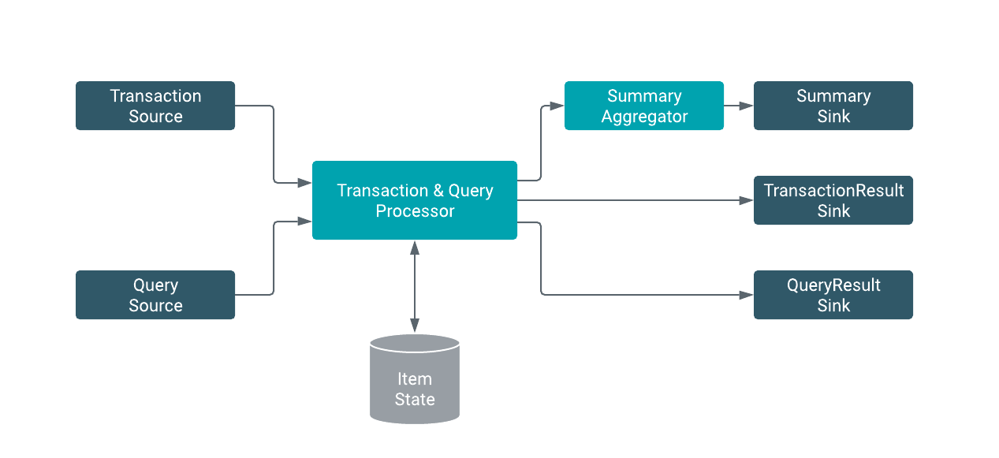

# Real-time item management service

## Table of contents
1. [Overview](#overview)
2. [Flink Streaming Application](#app)
    1. [Application structure](#structure)
    2. [Inventory management logic](#mgmt-logic)
    3. [Kafka inputs and outputs](#kafka)
    4. [Windowed summaries](#windowing)
3. [Testing and Validation](#testing)
4. [Production Configuration](#prod-config)
    1. [StreamExecutionEnvironment configuration](#streamenv)
    2. [Parallelism and Resources](#resources)
    3. [Kafka configuration](#kafka-config)
5. [Deployment](#deploy)
    1. [Transaction Generator Job](#generator-deploy)
    2. [Transaction Processor Job](#job-deploy)

## Overview <a name="overview"></a>

This streaming application implements the backend logic of an item management system. You can think of this as the service handling the available items for a large e-commerce site or any other similar application.

Our service should have the following capabilities:

 1. Validate and execute the incoming item transaction requests (new stock / purchase requests essentially)
 2. Output the result of the transactions (success / failure)
 3. Expose query functionality for the current item status (number in stock)
 4. Output periodic transaction summaries

We design the application to scale to very large transaction and query rates (up to millions of transactions/queries per second) and also to be able to handle very large inventories (hundreds of millions or more items). As always the scale at which the application can perform well will depend on the available resources, but we will provide you the configurations guidelines to achieve good performance on the desired scale.

### Overview of the data pipeline

Let's take a quick look at a simple illustration of our data pipeline:



From this we can identify the key elements of our dataflow

 1. Transaction & Query sources
 2. Stateful Transaction & Query processor
 3. Transaction Summary aggregator
 4. Output sinks

Our core business logic will be built into **2.** and **3.** and the data input sources and output sinks will be chosen depending on our environment.

For production deployments we will use Kafka as our data input and output bus, but for testing and local deployments we will replace it with something more simple like data generators and socket based sources.

## Implementing the Flink application <a name="app"></a>

### Structuring the application code <a name="structure"></a>

With production applications it's very important that we structure them in a way that it makes testing and input/output configuration easy without affecting the business logic.

To achieve this we implemented our core logic in the `ItemTransactionJob` abstract class. Subclasses only need to provide the input and output logic by implementing the following methods:

```java
// ...
abstract DataStream<Query> readQueryStream(...);
abstract DataStream<ItemTransaction> readTransactionStream(...);
abstract void writeQueryOutput(...);
abstract void writeTransactionResults(...);
// ...
```

This way our production job will simply be a subclass of `ItemTransactionJob` and can read and write to Kafka while our tests can easily verify correct behaviour by using more controlled sources and sinks.

To run the actual application we need to call the `createApplicationPipeline(parameters)` which will return an instance of `StreamExecutionEnvironment` that we can `.execute(...)`.

The main method (entrypoint for the Flink client) in the `KafkaItemTransactionJob` is implemented to leverage this simple pattern:

```java
public static void main(String[] args) throws Exception {
       // ...
       ParameterTool params = ParameterTool.fromPropertiesFile(args[0]);
       new KafkaItemTransactionJob()
                .createApplicationPipeline(params)
                .execute("Kafka Transaction Processor Job");
}
```

In addition to factoring the core logic into its own class we also use the `ParameterTool` utility throughout the code to pass configuration parameters to our pipeline such as Kafka configuration, operator configs.

`ParameterTool params = ParameterTool.fromPropertiesFile(args[0]);`

As we can see here we parse the properties file under the provided path into the ParameterTool object. This object can now be safely used by our function implementations.

### Inventory management and query logic <a name="mgmt-logic"></a>

We use the following simple POJO types to capture our data structure. Notice that all types have only public, non-final fields and have an empty constructor for efficient serialization.

*Input*
 - `ItemTransaction` : (long transactionId, long ts, String itemId, int quantity)
 - `Query` : (long queryId, String itemId)

*Keyed State*
 - `itemId -> ItemInfo` : (String itemId, int quantity)

*Output*
 - `TransactionResult` : (ItemTransaction transaction, boolean success)
 - `QueryResult` : (long queryId, ItemInfo itemInfo)

Both `ItemTransaction` and `ItemQuery` requests need access to the current item state so we need to process them in a single operator as we cannot share the state between multiple operators in Flink.

To process multiple input streams in a single operator we can either `union` them if they are the same data type or `connect` them to create `ConnectedStream` which allows us to handle the input of the connected streams independently of each other. In our case we have 2 different types and we want to separate the transaction and querying logic so we use `connect`.

We connect the `ItemTransaction` and `ItemQuery` streams after applying `.keyBy("itemId")` on both of them which partitions the streams according to their itemId and allows us to use keyed states in our processing operator. We implement the operator logic in a `CoProcessFunction` which allows us to access state and also exposes some lower level functionality like side-outputs to let us send 2 output streams to separete transaction and query results nicely.

Note that we assigned a uid to the operator by calling `.uid("Transaction Processor")`. This is makes it possible for Flink to restore the state of the operator from the checkpoint even if the processing pipeline changes. It is very important to always assign unique uids to stateful operators.

#### TransactionProcessor

In our `CoProcessFunction` the `processElement1` method takes care of applying or rejecting new transactions on our inventory state and `processElement2` simply reads this state to serve queries.

The main output type of the function is `TransactionResult` which will populate the output `DataStream` of our operator (named `processedTransactions` in our pipeline) and we use `QUERY_RESULT` OutputTag to produce a side output stream of the query results. The side output is later accessible by calling `.getSideOutput(QUERY_RESULT)` on the operator.

This pattern allows us to avoid using a union output type that we have to filter out downstream such as (`Either<TransactionResult, QUERY_RESULT>`)

The `ItemInfo` state is created during the operator initializaiton step in the `open(...)` method and it is a simple `ValueState` object that allows us to store an `ItemInfo` instance per key (`itemId`).

### Setting up Kafka inputs and outputs <a name="kafka"></a>

As we have seen earlier the `KafkaItemTransactionJob` extends our abstract `ItemTransactionJob` and implements the Kafka wiring logic to read the query and transactions streams and to write the outputs at the end.

It expects the following parameters configured in our properties file:
```
kafka.bootstrap.servers=<your_broker_1>:9092,<your_broker_2>:9092,<your_broker_3>:9092
kafka.group.id=flink
transaction.input.topic=transaction.log.1
query.input.topic=query.input.log.1
query.output.topic=query.output.log.1
```

We use Kafka in our production application as it provides scalability for our application and it is very easy to integrate with other services in the future.

We could for example easily build a RESTful java application that would receive transaction and query requests form the users and communicate asynchronously with the Flink job using Kafka messages to power any user facing application.

#### Setting up the FlinkKafkaConsumer sources

The `FlinkKafkaConsumer` class is used to consume the input records.

Let's look at one of the consumers:

```java
transactionSource = new FlinkKafkaConsumer<>(
                params.getRequired(TRANSACTION_INPUT_TOPIC_KEY),
                new TransactionSchema(),
                Utils.createKafkaConsumerProps(params.get(KAFKA_BROKERS_KEY),
                params.getRequired(KAFKA_GROUPID_KEY)));

transactionSource.setCommitOffsetsOnCheckpoints(true);
transactionSource.setStartFromEarliest();
```

The FlinkKafkaConsumer can be created with a few different constructors, in our case we provide:
 1. Topic to consume
 2. Schema implementation that provides the message deserialization format
 3. Consumer properties

For ItemTransactions we use the custom `TransactionSchema` implementation that serializers the records in a tab delimited text format for readability. We will use the same schema in our data generator job later to write to the kafka topic.

For Query inputs we use the built in `SimpleStringSchema` that can be used to read String data from kafka.

We created a simple utility class to generate the consumer properties based on our input properties (it extracts props with kafka. prefix):
 - `group.id=...` : *REQUIRED*
 - `bootstrap.servers=...` : *REQUIRED*
 - `flink.partition-discovery.interval-millis=60000` : Used by flink to control how often the consumed topics are checked for new partitions. (Disabled by default)

Flink relies on its own consumer offset management when consuming kafka messages. The `.setCommitOffsetsOnCheckpoints(true)` tells the consumer to commit offsets on Flink checkpoints so other tools can track the consumed messages.

Finally we set the consumer start offset that takes effect when the job is started for the first time (no checkpoint present). When a job is restored from a checkpoints or recovers after a failure it will always continue exactly where it left off.

#### Setting up the FlinkKafkaProducer sinks

Let's look at the Kafka sink used to write query results:

```java
FlinkKafkaProducer<QueryResult> queryOutputSink = new FlinkKafkaProducer<>(
                params.getRequired(QUERY_OUTPUT_TOPIC_KEY),
                new QueryResultSchema(),
                Utils.createKafkaProducerProps(params.getRequired(KAFKA_BROKERS_KEY)),
                Optional.of(new HashingKafkaPartitioner<>()));
```

We specify the following constructor parameters:

 1. Default producer topic (can be set dynamically from the schema if needed)
 2. Serialization schema for the QueryResults objects
 3. Producer properties
 4. Partitioner for the kafka messages

The `QueryResultSchemae` provides simple tab delimited format for the messages and we use the queryId as the key for the kafka records.

For the producer properties we set the following 2 parameters:
 - `bootstrap.servers=...` : *REQUIRED*
 - `retries=3` : Let the producer retry failed messages up to 3 times before failing the job. This is useful in production environment where broker changes are expected.

We use a custom Kafka partitioner that will ensure that queryResult messages are partitioned according to their queryIds which would allow us to create a nicely scalable querying service.

### Windowed transaction summaries <a name="windowing"></a>

An interesting thing to compute would be the number of failed and successful transactions together with the total volume for each item over a given time frame. If we notice that some items have exceptionally transaction failure rates for instance that might indicate some problem with other systems.

```java
processedTransactions
         .keyBy("transaction.itemId")
         .timeWindow(Time.minutes(1))
         .aggregate(new TransactionSummaryAggregator())
         .filter(new SummaryAlertingCondition(params));
```

By using the standard windowing API we can transparently switch between event and processing time by setting the TimeCharacteristics on the StreamExecutionEnvironment.

## Testing and validating our pipeline <a name="testing"></a>

Simple Flink jobs can be tested by providing a List of input records running the job. Once it completes, with some tricks, we validate the output. This approach however is only applicable in the simplest cases, and fails miserably for most real-world applications where the expected output depends on the order of input elements from multiple sources and the lack of ordering guarantees in the pipeline.

To illustrate the problem let's think about implementing a test for the item querying behavior. What we would need for this is first send in a few transactions for itemId `item_1` then send in a query for the same item. We would then assert that the query result matches our expectations. This sounds simple enough, but unfortunately it is impossible to guarantee that the transactions will get to the `TransactionProcessor` operator before the query using the collection based sources.

To allow integration testing complex pipelines we developed a few simple and effective testing utilities:

1. `JobTester` : Utility to create `ManualSource`s and execute manual pipeline integration tests. Enhances the functionality of the standard `StreamExecutionEnvironment`.
2. `ManualSource` : Creates a blocking channel to the running Flink source allowing the test to fully control event order from multiple sources.
3. `CollectingSink` : Creates a sink that can be polled for the sinked elements, allowing simple assertions when combined with manual sources.

Let's look at the `TransactionProcessorTest` to understand the testing behaviour.

This test validates the transaction processing and querying behaviour. To control the inputs both query and transaction input streams are created from manual sources:

```java
@Override
public DataStream<Query> readQueryStream(ParameterTool params, StreamExecutionEnvironment env) {
    querySource = JobTester.createManualSource(env, TypeInformation.of(Query.class));
    return querySource.getDataStream();
}
```
Note that we just create the source store a reference to it but do not yet specify any input data.

We will be validating query and transaction output so we create `CollectingSink`s:

```java
private CollectingSink<QueryResult> queryResultSink = new CollectingSink<>();

//...

@Override
public void writeQueryOutput(ParameterTool params, DataStream<QueryResult> queryResultStream) {
    queryResultStream.addSink(queryResultSink);
}
```

Now that we have wired together our data inputs and outputs, we will run our test pipeline in the `runTest` method:

```java
@Test
public void runTest() throws Exception {
   JobTester.startTest(createApplicationPipeline(ParameterTool.fromArgs(new String[]{})));

   ItemTransaction it1 = new ItemTransaction(1, 2, "item_1", 100);
   transactionSource.sendRecord(it1);
   assertEquals(new TransactionResult(it1, true), transactionResultSink.poll());

   querySource.sendRecord(new Query(0, "item_1"));
   assertEquals(new QueryResult(0, new ItemInfo("item_1", 100)), queryResultSink.poll());

   JobTester.stopTest();

   assertTrue(transactionResultSink.isEmpty());
   assertTrue(queryResultSink.isEmpty());
}
```

The main difference compared to regular job execution is that we don't call `.execute(..)` on the environment. Instead we use the `JobTester.startTest(env)` method to trigger application execution in a non-blocking way.

Once the test is started, we can send records using our `ManualSources` and use the poll method of the `CollectingSink` to wait for the outputs (they don't immediately arrive as this is a streaming pipeline running in different threads).

After running our test logic we call `JobTester.stopTest()` to shut down all the manual sources and let the pipeline finish completely. At the end we assert that no more output was received before the job completely shut down as expected.

### Socket Transaction Processor Job

We can also do a more interactive local testrun of our application by executing the `com.cloudera.streaming.examples.flink.SocketTransactionProcessorJob` class. It is contained in the test package to bundle all the necessary runtime deployments.

This job will take it's input from a local text socket and will run in our IDE, producing the output to the console.
Before we execute the code we should start the local socket at port `9999`:

```
nc -lk 9999
```

Now the job starts up with the built in data generator and we can start sending our queries and look at the output:

 - input (socket): `123 item_2`
 - output (IDE console): `QueryResult{queryId=123, itemInfo=ItemInfo{itemId='item_2', quantity=10665}}`

By modifying this application we can easily experiment with different aspects of our pipeline locally.

### Testing input and output connectors

It is possible to bootstrap test environments for our connectors such as Kafka and test the full production pipeline locally but in this case we chose to only test the correct application behaviour and assume that the connectors work as expected.

In most cases it is enough to unit test custom schema and partitioning configuration and assume the correct behaviour for the connectors themselves.

### Unit testing

We have seen above an example for a pipeline integration test. While it is important to have integration tests for the complex pipeline behavior it is also good practice to unit test the individual components and operator implementations, either as small test jobs or using one of the numerous testing utilities.

## Production configuration <a name="prod-config"></a>

### Configuring the StreamExecutionEnvironment <a name="streamenv"></a>

The `ItemTransactionJob.createExecutionEnvironment(...)` method is responsible for configuring the `StreamExecutionEnvironment`. We use the same settings for both production and testing to ensure that we test as close to the cluster behaviour as possible.

We will only configure things in the StreamExecutionEnvironment that are essential to our application logic or cannot be configured from the Flink configuration otherwise. For example we will not set parallelism and state backend configuration here as those come from the Flink conf.

#### Max parallelism

All production jobs should set an explicit maximum job parallelism by calling `setMaxParallelism(???)` which controls the number of key-groups the state backends create. We should consider 3 things when setting the max parallelism

 1. The number should be large enough to accommodate expected future load increases as this setting cannot be changed now without starting from empty state
 2. If `P` is the selected parallelism for our job, the max parallelism should be divisible by `P` to get even state distribution (`maxP % P == 0`)
 3. Larger max parallelism settings come at a greater cost on the state backend side so we shouldn't be overly pessimistic with out load estimates

From these criteria we suggest using factorials or numbers with a large number of divisors (120, 180, 240, 360, 720, 840, 1260) making parallelism tuning easier in the future.   

#### Checkpointing settings

Certain checkpointing configs can only be set in the StreamExecutionEnvironment at the moment of writing so we configure these. Most of these are accessible through the `env.getCheckpointConfig()` configuration object.

We set the following parameters here:
 - To enable checkpointing we configure the default checkpoint interval to 1 minute
 - We set checkpointing mode to EXACTLY_ONCE (this is also the Flink default mode)
 - We set checkpoint timeout to 1 hour in case some checkpoint would take longer than expected to complete
 - We enable externalized checkpoints, so we can restore our job from checkpoints as well in addition to savepoints when needed
 - We enable checkpoint compression to reduce the overall state size and speed up recovery

### Parallelism and resources <a name="resources"></a>

To fully control the resource utilization of our Flink job we set the following CLI parameters:

- `-p 8` : Parallelism of our pipeline. Controls the number of parallel instances of each operator.
- `-ys 4` : Number of task slots in each TaskManager. Will determine the number of Task managers -> #TM = p/ys
- `-ytm 1500` : TaskManager container memory size. Together with the `containerized.heap-cutoff-ratio` controls the heap size available to each task manager.

Coming up with good resource parameters is a hard and usually iterative process that largely depends on the actual job.

1. Estimate memory requirements based on state size and key cardinality.
2. Start the job at moderate parallelism. A good number starting number would be the number of Kafka partitions, or our (data rate per sec) / 10-50k depending on the complexity of the job, whichever is smaller.
3. Test the job at or over peak throughput and monitor backpressure and garbage collection
4. Increase parallelism or memory if it's not enough, then go back to 3.

```
itemId < 50B
ItemInfo < 80B
TransactionSummary < 100B
State(Key -> ItemInfo) < 160B
State(Window, Key -> TransactionSummary) < 320B
```

For window state sizing we have to estimate the number if in-flight windows per key. For our application let's say we have max 2 windows active for any key.

For 1 million items a very generous estimate would be:

```
1.000.000 * 160B + 2 * 1_000_000 * 320B ~ 800MB
```

We can round this up to 1GB to be on the even safer side. This means if we split the state on 2 TaskManagers we need to give them an extra 500MB memory on top of the default 1000MB associated to them -> `-ytm 1500`

#### RocksDB state backend for larger state

By default flink jobs use the Heap state backend to store key-value states. This means all data will be stored in deserialized form on the java heap. If memory permits this is very efficient but in many cases the state won't fit in main memory and we need to spill to disk.

The RocksDB statebackend stores key-value states in embedded RocksDB instances, seamlessly spilling from memory to disk when necessary. In contrast with the Heap statebackend, RocksDB doesn't use the java heap but keeps data in native memory. This is important when configuring the memory settings for our taskmanagers:

`TaskManager container size = TaskManager heap size + Containerized heap cutoff`

The default value for `containerized.heap-cutoff-ratio` is 0.25 which means that only 25% of the container memory is allocated for non-heap usage. While for regular flink apps this is plenty, once we enable rocks db we have to increase this ratio to 0.5 - 0.9 depending on our total container size (and heap usage) to give enough memory for RocksDB.

To enable RocksDB we should set the following flink config parameters:
```
state.backend = ROCKSDB
containerized.heap-cutoff-ratio = 0.5 - 0.9
state.backend.rocksdb.disk-type = SSD / SPINNING
```

### Kafka topic configuration <a name="kafka-config"></a>

We should ensure that our high-throughput topics such as the transaction input and output topics have enough partitions. The good number depends on the estimated peak throughput. In our example we will go with 16.

## Deploying the application <a name="deploy"></a>

We first need to build a fatjar of our application by using:

```
mvn clean package
```

If all run correctly the jar is located under `target/flink-stateful-tutorial-1.0-SNAPSHOT.jar`.

Now it's time to copy our jar and job configuration located under `config/job.properties` to our cluster.

### Kafka Data Generator <a name="generator-deploy"></a>

To make it easier to play with and performance test our application we included a simple data generator Flink job that generates `ItemTransaction` data to a target kafka topic. It takes 2 configuration parameters that we can include in our job configuration file:

```
num.items=1000000
transaction.input.topic=transaction.log.1
```

We reuse the config key for the target kafka topic from our main application configuration to avoid duplicating config options and making a mistake when running our service.

Starting the streaming job to generate transaction data

```
# First create the kafka topic with 16 partitions
kafka-topics --create --partitions 16 --replication-factor 1 --zookeeper <your_zookeeper>:2181 --topic transaction.log.1

# Run the data generator job
flink run -m yarn-cluster -d -p 2 -ys 2 -ynm DataGenerator -c com.cloudera.streaming.examples.flink.KafkaDataGeneratorJob target/flink-stateful-tutorial-1.0-SNAPSHOT.jar config/job.properties
```

We can now check the configured kafka topic for the generated transaction data stream from the command line:

```
kafka-console-consumer --bootstrap-server <your_broker_1>:9092 --topic transaction.log.1
```

### Kafka Transaction Job <a name="job-deploy"></a>

Now that we have a transaction input stream in the `transaction.log.1` topic we can deploy our transaction processor job.

```
flink run -m yarn-cluster -d -p 8 -ys 4 -ytm 1500 -ynm TransactionProcessor target/flink-stateful-tutorial-1.0-SNAPSHOT.jar config/job.properties
```

*If the deployment hangs, make sure that **yarn.scheduler.maximum-allocation-vcores** is set to at least 4 in the YARN configuration for the cluster*

Once the job is up and running, we can look at the Flink UI and (hopefully) observe that our job doesn't go as fast as our data generator.

By looking at the `numRecordsInPerSecond` metric at one of our transaction processor subtasks we can see that each parallel instance processes around 30k/sec totaling to about 240k item transactions per sec for our job.

On backpressure page we cannot see High backpressure reading at the source or downstream instances so we can say with some confidence that we are probably bottlenecked at the Kafka consumer.


A bottleneck at the TransactionProcessor would show high backpressure at the source and a bottleneck at the window operator would backpressure all upstream operators.

We can also look at the checkpoints page where we see the completed and triggered checkpoints along with the compressed checkpoint state sizes.


*Sending queries*

```
kafka-console-producer --broker-list <your_broker_1>:9092 --topic query.input.log.1
```

*Getting query output*
```
kafka-console-consumer --bootstrap-server <your_broker_1>:9092 --topic query.output.log.1
```

*Taking a savepoint*
```
flink savepoint -m yarn-cluster -yid yarnAppID flinkJobId
```

*Restoring from a savepoint*

```
flink run -m yarn-cluster -d -p 8 -ys 4 -ytm 1500 -ynm TransactionProcessor -s hdfs://savepointpath target/flink-stateful-tutorial-1.0-SNAPSHOT.jar config/job.properties
```
